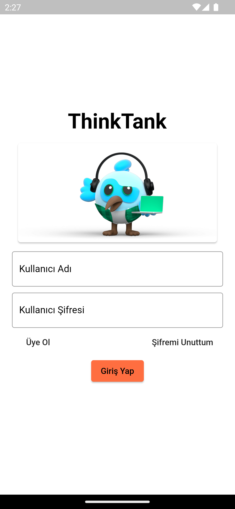
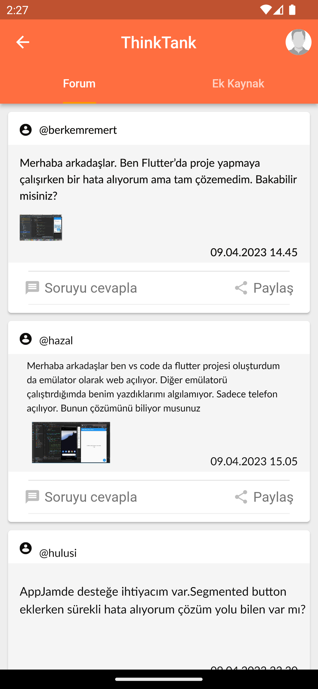
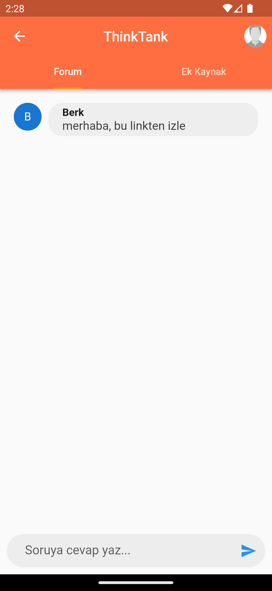
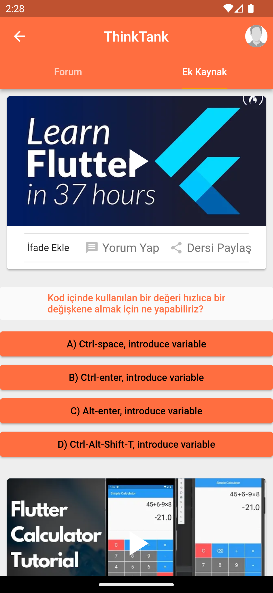
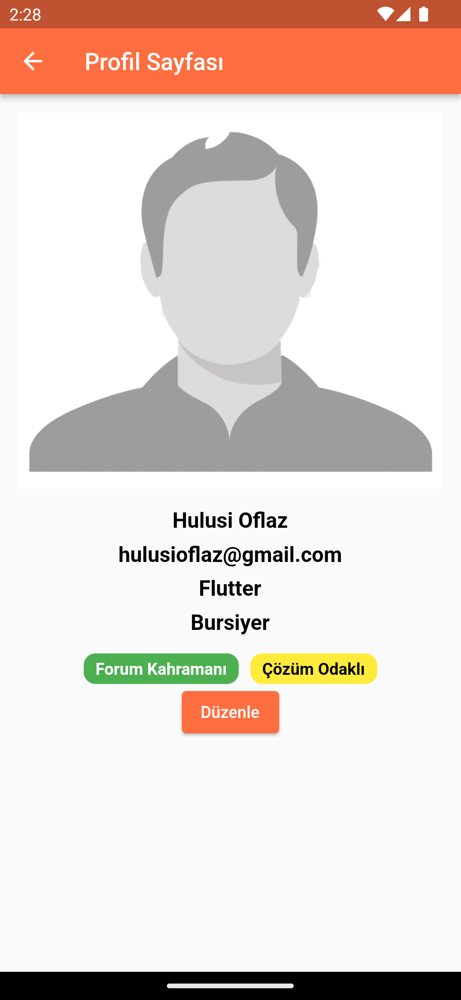
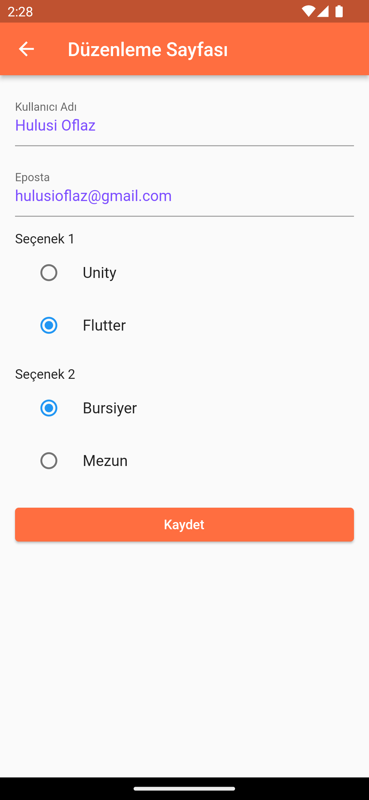
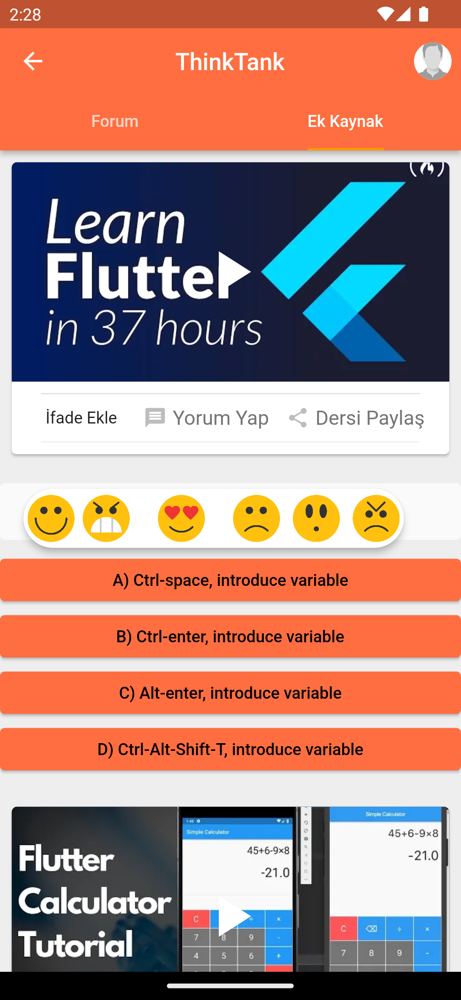
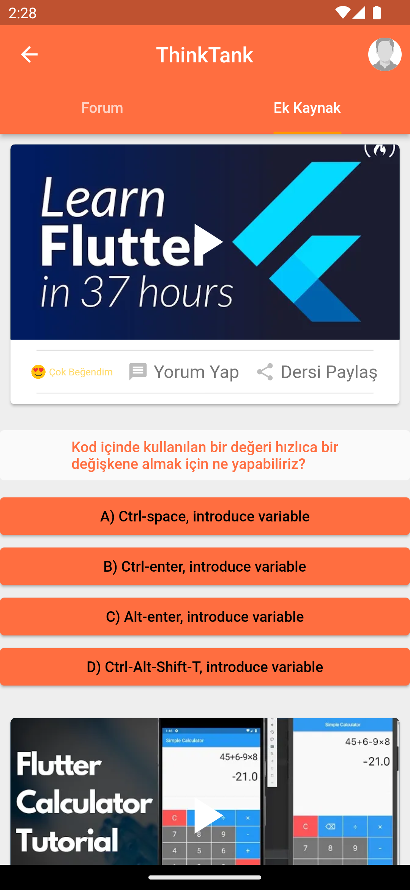
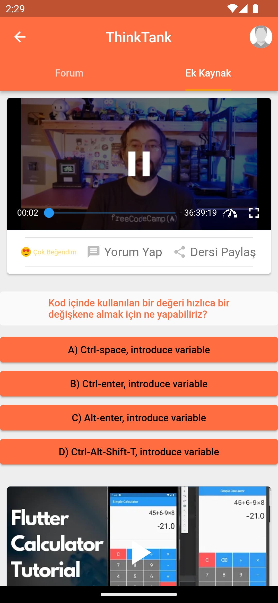

# ThinkTank
ThinkTank is an application that allows students to interact with  each other, share resources, and easily access information. With ThinkTank, you can ask questions on the forum page, improve yourself with the most needed videos on the extra resources page, and answer questions.
## Installation
To download ThinkTank application, enter the following command into the terminal:

    $ flutter pub get
## Usage
ThinkTank application allows students to interact with each other. In the application, users can ask questions on the forum page, improve themselves with the most needed videos on the extra resources page, and answer questions. You can earn new badges on your profile according to the events in the forum.
## Contributing
ThinkTank is an open source project. Everyone can contribute to the project. If you want to contribute, please visit our GitHub page.
## License
ThinkTank is licensed under the MIT License. See the LICENSE file for more information.
## Developers
- [@ihoflaz](https://github.com/ihoflaz)
- [@dilahazalbilgin](https://github.com/dilahazalbilgin)
- [@berkemremert](https://github.com/berkemremert)
- [@Kevserkrhnc](https://github.com/Kevserkrhnc)
## Screenshots

## Support
For your questions or feedbacks, please visit the "Issues" tab on our GitHub page.
## Thank You
Thank you for supporting us by  using ThinkTank application!